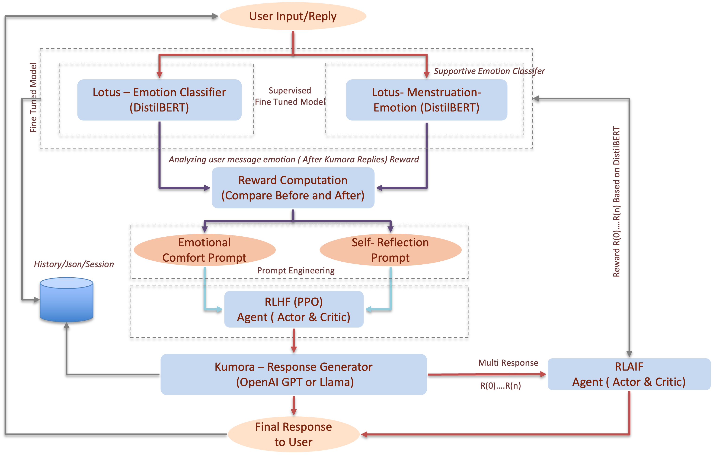

#### | KUMORA @ V1


<!-- PROJECT LOGO -->
<br />
<div align="center">
  <!--<a href="https://github.com/kunchhan/kumora-ai">
    
  </a>-->
  <h1 align="center">    KUMORA</h1>

  <p align="center">
    A Soulful AI for Emotional Intelligence and Self-Reflection
    
  </p>
</div>


<!-- TABLE OF CONTENTS -->
<details>
  <summary>Table of Contents</summary>
  <ol>
    <li>
      <a href="#about-the-project">Introduction</a>
      <ul>
        <li><a href="#vision">Vision</a></li>
        <li><a href="#architecture-overview">Architecture Overview</a></li>
      </ul>
    </li>
    <li><a href="#built-with">Built With</a></li>
    <li><a href="#datasets">Datasets</a></li>
    <li><a href="#toolsModel">Tools/Model for Emotion Classification </a></li>
    <li>
      <a href="#getting-started">Getting Started</a>
      <ul>
        <li><a href="#prerequisites">Prerequisites</a></li>
        <li><a href="#installation">Installation</a></li>
      </ul>
    </li>
    <li><a href="#orihect-folder-structure">Project Folder Structure</a></li>
    <li><a href="#author">Author</a></li>
    <li><a href="#license">License</a></li>
    <li><a href="#contact">Contact</a></li>
    <li><a href="#acknowledgments">Acknowledgments</a></li>
  </ol>
</details>


<!-- ABOUT THE PROJECT -->
## About The Project

Kumora is gentle and emotionally-aware AI Chatbot designed to support women during sensitive moments, especially during mensturation.
She offers soft, reflective response to help users feel heard, comforted, and emotionally understood. 

This project is being developed as part of the COMP8420- Advanced Natural Language Processing major projet at Macquarie University. 

This project addresses the prevalent “empathy deficit” in contemporary Natural Language Processing (NLP) applications, where AI systems often excel at tasks but fall short in offering genuine emotional support or facilitating deep self-reflection. We introduce Kumora, a soulful AI companion designed to support women particularly during emotionally vulnerable periods such as menstruation by fostering emotional intelligence and creating a safe space for introspection. Kumora’s uniqueness stems from its meticulously crafted core prompt architecture, inspired by cognitive science and its CMS-inspired conceptual model (drawing on concepts like ACC, PCC, VMPFC, and Insula), which guides a nuanced, non-directive, and reflective conversational style. 

Central to Kumora’s design is the principle that facilitating user self-discovery is key to closing the emotional gap in human-AI interaction. By encouraging users to understand and connect with their inner experiences, Kumora moves beyond transactional dialogue to enable emotional growth. Her capacity to foster this growth is further enhanced through dynamic emotion classification, allowing Kumora to adapt to evolving user states in real-time. Ethical considerations particularly around emotional safety, user sovereignty, and non-maleficence are foundational to her design. This report presents Kumora’s design philosophy, its prompt-driven methodology, implementation details, and a qualitative evaluation showing her potential to deliver a more human-centric, emotionally aware AI experience than existing solutions.

## Vision

Kumora is not just a chatbot — she is a kind presence.
Her main purpose is to support emotional well-being and encourage self-connection during moments of vulnerability and emotional change.

## Architecture Overview
Kumora's backend is developed using Flask (Python 3.11). It comprises:
*   **Emotion Classifier:** A DistilBERT model fine-tuned on GoEmotions, ISEAR, and menstrual health datasets.
*   **Prompt Generator:** Builds dynamic prompts using user input, emotion score, and a Core System Prompt (Appendix A).
*   **LLM Integration:** OpenAI's GPT-3.5-turbo was used via API. Though LLaMA was planned, it was not implemented due to time constraints.
*   **RL Reward log/History:** A reinforcement learning-compatible logger records state-action-reward-emotion tuples (Appendix C).


<p align="center" ></p>

<p align="right">(<a href="#readme-top">back to top</a>)</p>


### Built With

This section should list any major frameworks/libraries used to bootstrap your project. Leave any add-ons/plugins for the acknowledgements section. Here are a few examples.

* Python, Flask (Python3.10).
* HTML/CSS/Bootstrap
* JavaScript
* Machine Learning: PyTorch, Hugging Face Transformers, Scikit-learn
* Database: JSON, Session
* LLM APIs: Llama, OpenAI


## Datasets

The emotion classifier used in Kumora was trained on a two-phase dataset setup. 

* **Phase 1:** we used publicly available datasets including GoEmotions (27 emotion labels, Reddit comments). 

* **Phase 2:** we curated a domain-specific dataset focusing on menstrual health and emotional states by scraping user comments from Reddit, YouTube, and anonymized discussion forums. This domain-relevant data helped fine-tune Kumora's classifier to detect nuanced states like cramps, overwhelm, and vulnerability. The final dataset included approximately [insert number] labeled samples across 25+ emotion categories.


<p align="right">(<a href="#readme-top">back to top</a>)</p>

## Tools/Model for Emotion Classification 
We trained a DistilBERT classifier using a blend of public datasets and manually annotated Reddit/YouTube comments. It outputs one of 25+ emotion labels and a confidence score. The top emotion, score, and history are passed to Kumora's prompt for contextual response generation.

<!-- GETTING STARTED -->

## Getting Started

This to run the project on your system follow those simple steps.

### Prerequisites

This is an example of how to setup virtual environment for this project.
1. Clone the repo inside project directory
   ```sh
   git clone https://github.com/kunchhan/kumora-AI.git .
   ```
   
2. Using Conda
    ```sh
    conda create --name kumora_env python=3.10
    ```
3. Activate the kumora_env Virtual Environment
    ```sh
    conda activate kumora_env
    ```
Or

1. Using python inside cloned folder 

    ```sh
    cd project_dir/kumora-ai
    ```

2. Using python inside project

    ```sh
    python3 -m venv .venv

3. Activate the kumora_env Virtual Environment
    ```sh
    # On Windows
    .venv\Scripts\activate
    ```
    ```sh
    # On Linux Mac
    source .venv/bin/activate
    ```
### Installation

_Installation guidance along with project start._


2. Install all required packages
   ```sh
   pip install -r requirements.txt
   ```
3. Configure Environment Variables from sample.env sample and rename to .env update KEYS
   ```js
    OPENAI_API_KEY="your_openai_api_key_here"
   ```
4. ****Important** Download the trained model form the given link below and extract those two model under folder structure _Kumora-ai/models  ***1. "lotus_general_emotion"*** and ***2."lotus_menstrual_emotion"*** <br>

      [Click Here to Download Trained Models](https://drive.google.com/file/d/1VeOEUGOuOt4IX9DjRlmLNHYdsTaGvz8z/view?usp=sharing)

5. Start the project 
   ```sh
   python3 app.py 
   ```
6. Follow the running link along with port to your favourite browsewr 
   ```sh
   * Running on http://127.0.0.1:5000
   ```
   [Click Here : http://127.0.0.1:5000](http://127.0.0.1:5000)


<!-- Project  Structure -->

## Project Folder Structure
```
Kumora-ai/
├── app.py
├── core_system/                        # Core System File 
│   ├── app.py
│   ├── modules/                        # Modules file for Prediction emotion 
│   │   ├── kumora_response_score/
│   │   │   └── style_score.py
│   │   ├── lotus_model/
│   │   │   ├── __init__.py
│   │   │   ├── loader.py
│   │   │   └── predictor.py
│   │   ├── lotus_model_menstrutation/
│   │   │   ├── __init__.py
│   │   │   ├── loader.py
│   │   │   └── predictor.py
│   │   └── RLLogger/                     # Modules to Log and reward 
│   │       ├── __init__.py
│   │       ├── RewardStrategy.py
│   │       ├── rlaif_emot_resonant.py
│   │       └── rlhf_logger.py
│   ├── static/
│   │   ├── audio.mp3
│   │   ├── bg.jpg
│   │   ├── css/
│   │   │   └── chat.css
│   │   ├── image/
│   │   │   ├── kumora-logo.png
│   │   │   ├── SystemArchitecture.png
│   │   │   ├── thinking-white.gif
│   │   │   └── tictac_white.gif
│   │   ├── js/
│   │   │   └── chat.js
│   │   └── style.css.  
│   ├── templates/                           # Frontends Templates 
│   │   ├── companion-chat.html
│   │   ├── companion-talk.html
│   │   ├── kumora-chat.html
│   │   ├── login.html
│   │   ├── register.html
│   │   └── welcome.html
│   └── utils/
│       └── kumora_prompt_loader.py           # Kumora System Prompt Loader
├── dataset/                                  # Kumora Datasets 
│   ├── kumora_emotion/                       # General Emotion Sets
│   │   └── final_emotions_data.csv
│   └── menstrual_emotion/                    # Menstural Emotion Sets
│       ├── menstruation-emotionDSclean.csv
│       ├── Scrap                             # Scrap Data from Yoube and Rediti
│       │   ├── reddit_comment_scrap.py
│       │   └── YT_Comment_scrap.py
│       └── synthetic_data_womens_health.csv
├── kumora_rl_log.jsonl                        # RLHF/RLAIF Reward Log/ Chat History
├── models/                                    # ***** Important Main Trained Model File Need to Download and extract  and copy only 2 models 
│   ├── lotus_general_emotion/
│   │   ├── lotus_best_model_epoch3.pt
│   │   └── lotus_final_model/
│   │       ├── config.json
│   │       ├── model.safetensors
│   │       ├── special_tokens_map.json
│   │       ├── tokenizer_config.json
│   │       ├── tokenizer.json
│   │       ├── training_args.bin
│   │       └── vocab.txt
│   └── lotus_menstrual_emotion/
│       ├── lotus_menstrual_emotion_classifier_v1.pt
│       └── lotus_menstrual_emotion_model_v1/
│           ├── config.json
│           ├── model.safetensors
│           ├── special_tokens_map.json
│           ├── tokenizer_config.json
│           ├── tokenizer.json
│           └── vocab.txt
├── notebook/                                        # Jupyter Notebook contain training general Model and Menstural Data set.
│   ├── menstrual_emotion_classifier/                 # Menstural Emotion Classifer Training 
│   │   ├── saved_models/
│   │   ├── train_menstruation_cl.ipynb
│   │   └── train_menstruation_classifier.ipynb
│   └── train_general_emotion/                         # General Emotion 
│       ├── kumora_chatbot-custom.ipynb
│       ├── kumora_chatbot.ipynb
│       └── saved_final_model
├── prompts/
│   ├── kumora_emotion_responses.py
│   └── kumora_prompt.txt
├── README.md                                          # REDME file 
├── requirements.txt                                   # All Saved Module required to install 
└── sample.env
```


<!-- USAGE EXAMPLES
## Usage

This ai can use in different sector like , Mensturation 


<p align="right">(<a href="#readme-top">back to top</a>)</p> -->


<!-- Author -->
## Author

#### Kunchhan Lama
Creator and 
Project lead<br>
Macquarie University – COMP8420 Advanced Natural Language processing, 2025


<!-- LICENSE -->
## License

Distributed under the Unlicense License. See `LICENSE.txt` for more information.


<!-- CONTACT -->
## Contact

[@kunchhan ](https://github.com/kunchhan/) - kunchhan.lama@students.edu.mq.au

Project Link: [https://github.com/kunchhan/kumora-AI](https://github.com/kunchhan/kumora-AI)

<p align="right">(<a href="#readme-top">back to top</a>)</p>


<!-- ACKNOWLEDGMENTS -->
## Acknowledgment

I would like to express my deepest gratitude to the individuals and institutions who supported the development of this project.

* [Macquarie University || Faculty of Science and Engineering ]() , for providing a strong academic foundation and research environment.
* [Prof.Longbing Cao, Dr.Qiongkai Xu , and Mr. Weijun Li ]() for his guidance and encouragement throughout the development of this project.
* [Self-referential Processing in our brain || Northoff,G.,Heinzel and other ](https://doi.org/10.1016/j.neuroimage.2005.12.002)
* [ The Value of Emotional Intelligence || Antonopoulou, H. ](https://flexbox.malven.co/)
* [GitHub Pages](https://pages.github.com)
* [OpenAI & Hugging Face ]() communities for their open-source tools and documentation.
* All the researchers and developers whose work inspired this project.

<p align="right">(<a href="#readme-top">back to top</a>)</p>

## NOTE:
Please do not copy, reproduce, or redistribute this project or its emotional design without permission.
This repository is intended for academic use only during the current semester.


